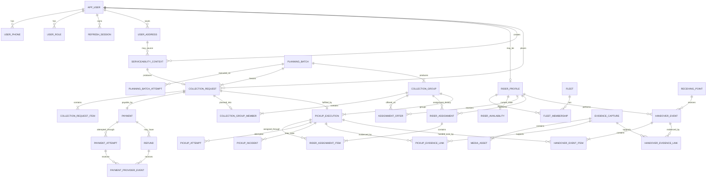

# Domain Model

## Purpose

This document defines the human-approved domain boundaries for Tirodhan before ORM models, migrations, APIs, or worker implementations are generated.

The guiding rule is:

> Prefer established application patterns over bespoke Tirodhan-specific modelling. Introduce product-specific structures only where the workflow genuinely differs.

Examples:

- identity follows standard account/session/RBAC patterns;
- addresses follow standard multi-address commerce/delivery patterns;
- collection requests follow standard order/booking patterns;
- payments/refunds follow standard payment-attempt/refund patterns;
- rider assignment follows standard dispatch/workforce patterns;
- pickup execution follows standard fulfilment/delivery-attempt patterns;
- evidence follows standard attachment/evidence patterns;
- only the geographic planning/compaction flow is materially Tirodhan-specific.

## Core principles

- One human has one `app_user` identity.
- A user may hold multiple roles.
- A user may have multiple saved addresses.
- Mutable profile/master data must not rewrite historical transactional facts.
- Paid/accepted bookings preserve booking-time snapshots.
- Payment, refund, assignment, pickup execution, handover, and evidence are separate lifecycle entities.
- Operational history is appended rather than overwritten where history matters.
- Idempotency is a system-wide invariant.
- PostgreSQL is the authoritative transactional state store.
- Service Bus is transport, not the source of truth.
- Exact spatial data is represented using PostGIS.
- Media bytes are stored in object storage; PostgreSQL stores metadata and relationships.

## Domain areas

### Identity and profile

- `app_user`
- `user_phone`
- `user_role`
- `refresh_session`
- `user_address`

A phone-number change preserves the same `user_id`. A user may have any number of saved addresses.

### Serviceability

- `serviceability_context`

A serviceability context is short-lived and represents a snapshot of the location being checked. It may originate from a saved address or a new one-off address entered during booking.

### Booking

- `collection_request`
- `collection_request_item`

`collection_request` is the order/booking aggregate root and preserves booking-time address, location, cell, slot and price facts.

### Payment and refunds

- `payment`
- `payment_attempt`
- `payment_provider_event`
- `refund`

A collection request has one logical payment obligation. Retries are separate `payment_attempt` rows. Provider events deduplicate/reconcile both payment and refund provider callbacks. Refunds are independent financial objects.

### Planning

- `planning_batch`
- `planning_batch_attempt`
- `collection_group`
- `collection_group_member`

A planning batch freezes the accepted request population for one geographic cell and pickup slot. Every request in a completed batch belongs to exactly one collection group. Groups may be compacted, normal singleton, or fallback singleton.

The persisted Phase 1F vocabulary is:

- batch status: `READY`, `COMPLETED`;
- attempt outcome: `STARTED`, `SUCCEEDED`, `FAILED`;
- group planning mode: `COMPACTED`, `NORMAL_SINGLETON`, `FALLBACK_SINGLETON`;
- batch completion mode: `ALGORITHM_RESULT`, `FALLBACK_RESULT`;
- initial pickup-execution status: `PENDING_ASSIGNMENT`.

### Rider and fleet

- `rider_profile`
- `fleet`
- `fleet_membership`
- `rider_availability`
- `assignment_offer`
- `rider_assignment`
- `rider_assignment_item`

Identity, fleet affiliation, rider intent, platform work state, offers and assignments are separate concepts. Fleet auto-assignment, independent acceptance and manager assignment all converge on `rider_assignment`.

### Pickup execution

- `pickup_execution`
- `pickup_attempt`
- `pickup_incident`

A `pickup_execution` is created for a planned request and remains the stable per-household fulfilment object. Before planning, a collection request has no PickupExecution. Assignment may change over time, but completed pickups are immutable and only outstanding work is reassigned.

### Receiving point and handover

- `receiving_point`
- `handover_event`
- `handover_event_item`

A receiving point is mutable master data. A handover event is a historical business fact and may contain several collected pickups.

### Evidence and media

- `evidence_capture`
- `pickup_evidence_link`
- `handover_evidence_link`
- `media_asset`

Evidence capture is the business event. Media asset is the stored file metadata. Blob upload state is separate from fulfilment state.

### Reliability infrastructure

- `idempotency_record`
- `inbox_message`
- `outbox_event`

These support systematic replay safety but never replace domain-level uniqueness and concurrency rules.

## Consolidated ER diagram



## Lifecycle summaries

### Collection request

```text
PENDING_PAYMENT
    ├── EXPIRED
    └── payment confirmed
            ↓
        ACCEPTED
            ├── CANCELLED
            └── planning freeze
                    ↓
              PRE_PLANNING
                    ↓
                 PLANNED
                    ↓
                COMPLETED
```

Operational exceptions such as customer unavailable or rider unable to continue are not collection-request statuses.

### Payment

```text
Payment = PENDING
  Attempt 1 FAILED
  Attempt 2 FAILED
  Attempt 3 SUCCEEDED
Payment = SUCCEEDED
```

### Planning

```text
ACCEPTED requests
    ↓ freeze
PRE_PLANNING + immutable planning_batch_id
    ↓
compaction attempts
    ├── success → compacted/singleton groups
    └── attempts exhausted → fallback singleton groups
    ↓
PLANNED + PickupExecution created
```

`PlanningBatchReady` starts explicit logical attempt 1. A technical failure may request attempt N>1 through `PlanningAttemptRequested`; broker redelivery never creates a new logical attempt. Technical failure is durably recorded as `FAILED`, while a database/infrastructure failure rolls back and leaves the same `STARTED` attempt recoverable. Exhausting the snapshotted attempt limit completes the batch using one fallback-singleton group per request.

### Assignment

```text
Offer(s)
   ↓
one valid acceptance / fleet assignment / manual assignment
   ↓
RiderAssignment
   ↓
PickupExecution(s)
```

### Handover

```text
Collected pickups
    ↓
HandoverEvent
    ↓
geofence + receiving-point + evidence validation
    ↓
VALIDATED
    ↓
CollectionRequest COMPLETED
```

## Deliberately open decisions

Do not silently decide:

- geographic cell resolution;
- compaction/clustering algorithm;
- detailed routing algorithm;
- item category taxonomy;
- final pricing formula;
- exact planning lead time, compaction-attempt limit, rider-offer deadline and retention periods;
- final payment provider;
- final CI/CD provider;
- frontend/mobile technology;
- exact mismatch workflow when collected material differs from booking;
- final offline-evidence validation policy.
