# Domain Model

## Purpose

This document defines the human-approved domain boundaries for Tirodhan before ORM models, migrations, APIs, or worker implementations are generated.

The guiding rule is:

> Prefer established application patterns over bespoke Tirodhan-specific modelling. Introduce product-specific structures only where the workflow genuinely differs.

Examples:

- identity follows standard account/session/RBAC patterns;
- addresses follow standard multi-address commerce/delivery patterns;
- collection requests follow standard order/booking patterns;
- payments/refunds follow standard payment-attempt/refund patterns;
- rider assignment follows standard dispatch/workforce patterns;
- pickup execution follows standard fulfilment/delivery-attempt patterns;
- evidence follows standard attachment/evidence patterns;
- only the geographic planning/compaction flow is materially Tirodhan-specific.

## Core principles

- One human has one `app_user` identity.
- A user may hold multiple roles.
- A user may have multiple saved addresses.
- Mutable profile/master data must not rewrite historical transactional facts.
- Paid/accepted bookings preserve booking-time snapshots.
- Payment, refund, assignment, pickup execution, handover, and evidence are separate lifecycle entities.
- Operational history is appended rather than overwritten where history matters.
- Idempotency is a system-wide invariant.
- PostgreSQL is the authoritative transactional state store.
- Service Bus is transport, not the source of truth.
- Exact spatial data is represented using PostGIS.
- Media bytes are stored in object storage; PostgreSQL stores metadata and relationships.

## Domain areas

### Identity and profile

- `app_user`
- `user_phone`
- `user_role`
- `refresh_session`
- `authentication_challenge`
- `user_address`

A phone-number change preserves the same `user_id`. A user may have any number of saved addresses.

Phase 1R AuthenticationChallenge binds encrypted phone plus keyed lookup HMAC to one provider
verification reference, with a separate public UUIDv7 identity. It is `ACTIVE`, `CONSUMED` after
committed login, or `SUPERSEDED` by a newer start. Expiry is derived without an EXPIRED state.
The provider owns the OTP credential; no OTP, hash, attempt count or delivery state is stored locally.

Phase 1O uses explicit canonical E.164 phone input and stores one active verified `user_phone` per
user using a recoverable encrypted value plus keyed lookup HMAC. A newly created verified user is
`ACTIVE` and receives only the `CUSTOMER` role; `RIDER` and `MANAGER` require explicit later
provisioning. Existing users are not silently re-granted a revoked customer role, and rider profile
existence is not authorization.

Each successful new login command creates an independent `refresh_session` with a stable opaque
credential, SHA-256 verifier, fixed expiry, and optional revocation time. Refresh does not rotate the
credential or extend expiry. Short-lived RS256 access JWTs identify only the user and session;
current authorization roles always come from active PostgreSQL `user_role` rows. A completed login
command whose original credential response was lost must start a new OTP verification because no
recoverable bearer credential is persisted.

### Serviceability

- `serviceability_context`

A serviceability context is short-lived and represents a snapshot of the location being checked. It may originate from a saved address or a new one-off address entered during booking.

Phase 1T uses Google Geocoding v3 for Delhi-first resolution and provider-independent
H3 resolution 7, storing the canonical raw H3 cell string. Async Service Bus resolution
is primary; checkout uses the same operation as a PENDING-only fallback (ADR-015).

### Booking

- `collection_request`
- `collection_request_item`

`collection_request` is the order/booking aggregate root and preserves booking-time address, location, cell, slot and price facts.

### Payment and refunds

- `payment`
- `payment_attempt`
- `payment_provider_event`
- `refund`

A collection request has one logical payment obligation. Retries are separate `payment_attempt` rows. Provider events deduplicate/reconcile both payment and refund provider callbacks. Refunds are independent financial objects.

Phase 1V uses Razorpay (`RAZORPAY`). A Tirodhan attempt maps to one recoverable Razorpay Order
by stable receipt. Captured provider payment is the successful charge; authorized is not success.
Persisted provider references, exact amount and currency govern webhook correlation/acceptance,
not internal payment IDs in notes or client callbacks. Failed provider attempts within one Order
may precede capture; their reference must never replace an established captured payment ID.
Explicitly authorized refunds use the canonical charge and normal native-idempotent execution.
Provider execution recovery does not change financial identity. Phase 2 Batch B adds the approved
full customer-cancellation compensation policy in ADR-005; non-cancelled expiry and separate
additional-charge accounting remain reconciliation decisions.

### Planning

- `planning_batch`
- `planning_batch_attempt`
- `collection_group`
- `collection_group_member`

A planning batch freezes the accepted request population for one geographic cell and pickup slot. Every request in a completed batch belongs to exactly one collection group. Groups may be compacted, normal singleton, or fallback singleton.

Normal Phase 1G compaction uses `BOUNDED_GREEDY_DIAMETER_V1`. A compacted group is valid only when every request pair is within the snapshotted PostGIS-geography distance in meters, and its household-stop count does not exceed `max_group_requests_snapshot`. Weight, volume, item category, rider capacity, and vehicle type are not planning inputs in this phase. Each batch snapshots its algorithm version and numeric policy so retries cannot drift with runtime configuration.

The persisted Phase 1F vocabulary is:

- batch status: `READY`, `COMPLETED`;
- attempt outcome: `STARTED`, `SUCCEEDED`, `FAILED`;
- group planning mode: `COMPACTED`, `NORMAL_SINGLETON`, `FALLBACK_SINGLETON`;
- batch completion mode: `ALGORITHM_RESULT`, `FALLBACK_RESULT`;
- initial pickup-execution status: `PENDING_ASSIGNMENT`.

### Rider and fleet

- `rider_profile`
- `fleet`
- `fleet_membership`
- `fleet_service_cell`
- `rider_service_cell`
- `push_registration`
- `offer_notification_delivery`
- `rider_availability`
- `assignment_offer`
- `rider_assignment`
- `rider_assignment_item`

Identity, historical fleet affiliation, cell coverage, rider intent, platform work state,
offers and assignments are separate concepts. Fleet and independent offers both converge on
`rider_assignment` through synchronous rider acceptance; manager assignment remains fallback.
Fleet-first means offering every eligible member of active fleets serving the group cell before
independent riders, not choosing or automatically assigning a fleet rider. No current membership
is permitted for independent selection, including membership in inactive fleets.

Phase 1U stores audience/fleet provenance only on AssignmentOffer. Common cohort timestamps and
one initial fleet (or immediate independent) round precede at most one independent fallback.
PushRegistration supports multiple devices and token replacement per current device.
OfferNotificationDelivery retains per-offer/device PENDING, SENT or PERMANENTLY_FAILED transport
results, not business assignment state. No device means the durable offer still exists.
Planning emits one transactional dispatch event per new group; Service Bus transports one
group/stage item, concurrent generic FCM push is best-effort/at-least-once, and PostgreSQL remains
the assignment authority. There is no saga or queued acceptance.

Phase 1H persists rider profiles as `ACTIVE` or `SUSPENDED`; availability intent as
`OFFLINE` or `AVAILABLE`; and platform work state as `IDLE`, `RESERVED`, or `BUSY`.
Initial assignment creates an `ACTIVE` assignment from either `RIDER_OFFER_ACCEPTED` or
`MANAGER_ASSIGNED`, attaches the full collection group through `rider_assignment_item`, moves
each pickup from `PENDING_ASSIGNMENT` to `ASSIGNED`, and reserves the rider. Offer state is
`OPEN`, `ACCEPTED`, or `CLOSED_LOST`; `expires_at` remains the expiry authority.
Phase 1J adds terminal assignment status `SUPERSEDED`: a manager-created
successor uses `MANAGER_ASSIGNED` plus `supersedes_assignment_id`, receives only residual
`ASSIGNED` pickups, and reserves the replacement rider while returning the predecessor rider to
`IDLE`. Transferred predecessor items are released with reason `REASSIGNED`; collected items stay
permanently anchored to the predecessor.

### Pickup execution

- `pickup_execution`
- `pickup_attempt`
- `pickup_incident`

A `pickup_execution` is created for a planned request and remains the stable per-household fulfilment object. Before planning, a collection request has no PickupExecution. Assignment may change over time, but completed pickups are immutable and only outstanding work is reassigned.

Phase 1I persists pickup execution as `PENDING_ASSIGNMENT`, `ASSIGNED`, or `COLLECTED` and rider
assignment as `ACTIVE` or `COMPLETED`. Assignment start is represented by `started_at` and moves
the rider from `RESERVED` to `BUSY`, including when future availability intent is `OFFLINE`.
Immutable pickup attempts are attributed to the performing rider assignment and record only
`COLLECTED` or `NOT_COLLECTED`. The final collected pickup still owned by an assignment completes
that assignment and returns its rider to `IDLE`; normal completion does not release assignment
items. Phase 1J incidents explicitly record an operational exception against both the stable
pickup and its historical rider assignment. Incident reasons are `CUSTOMER_UNAVAILABLE`,
`ADDRESS_NOT_FOUND`, `ACCESS_BLOCKED`, `RIDER_UNABLE_TO_REACH`,
`RIDER_UNABLE_TO_CONTINUE`, or `OTHER`; state is `OPEN` or `RESOLVED`, with `REASSIGNED` as the
only Phase 1J resolution.

### Receiving point and handover

- `receiving_point`
- `handover_event`
- `handover_event_item`

A receiving point is mutable master data. A handover event is a historical business fact and may contain several collected pickups.

Phase 1K receiving points are `ACTIVE` or `INACTIVE`. A handover snapshots the locked master
location and allowed radius, records the observed location and PostGIS distance, and has an outcome
of `VALIDATED`/`WITHIN_ALLOWED_RADIUS` or `REJECTED`/`OUTSIDE_ALLOWED_RADIUS`. Event and item
timestamps use the single server evaluation instant. A rejected event does not consume the pickup;
at most one item with `VALIDATED` status may exist for a pickup. Handover attribution follows the
unreleased historical rider-assignment item and does not require current assignment or rider
availability state. Evidence validation and collection-request completion remain later work.

### Evidence and media

- `evidence_capture`
- `pickup_evidence_link`
- `handover_evidence_link`
- `media_asset`

Evidence capture is the business event. Media asset is the stored file metadata. Blob upload state is separate from fulfilment state.

In Phase 1L, existence of `EvidenceCapture` means only that a trusted client registered completion
of the local in-app capture action. The capture is immutable and has no status, validation time,
evidence type, or location. `captured_at` is the client-claimed capture time normalized to UTC;
`created_at` is the authoritative server registration time. Exactly one pickup or handover link is
created atomically, while multiple distinct captures remain allowed per target. Pickup evidence
requires a `COLLECTED` pickup and historical unreleased assignment attribution to the actor.
Handover evidence requires the event's rider and is permitted for both validated and rejected
attempts. Media storage, content validation, sufficiency rules, completion, and outbox events are
not part of Phase 1L.

Phase 1M gives each `EvidenceCapture` zero or one original `MediaAsset`. Registration preserves a
client media ID and an opaque server-generated `media/<media_asset_id>` object key. The asset is a
`PHOTO` or `VIDEO` and is either `PENDING_UPLOAD` or `FINALIZED`. Finalization means only that the
provider-neutral storage inspection found the expected key with a matching declared/stored content
type and a size within configured policy. It does not establish semantic content validity,
evidence sufficiency, or fulfilment completion. Upload authorization is transient; storage failure
never mutates the evidence capture or its business target.

Phase 1N defines Option B as the MVP completion rule. The request's pickup must be `COLLECTED`,
belong to a `VALIDATED` handover item whose parent event is also `VALIDATED`, and have at least one
pickup-linked capture. That specific validated handover must independently have at least one
handover-linked capture. Historical rejected handovers and open or historical pickup incidents do
not block completion. `MediaAsset` existence, type, and upload state are irrelevant to sufficiency.
Eligible requests transition independently from `PLANNED` to `COMPLETED`; sibling requests,
assignment status, and media finalization are not prerequisites.

### Reliability infrastructure

- `idempotency_record`
- `inbox_message`
- `outbox_event`

These support systematic replay safety but never replace domain-level uniqueness and concurrency rules.

## Consolidated ER diagram

```mermaid
erDiagram
    APP_USER ||--o{ USER_PHONE : has
    APP_USER ||--o{ USER_ROLE : has
    APP_USER ||--o{ REFRESH_SESSION : owns
    APP_USER ||--o{ USER_ADDRESS : saves
    APP_USER ||--o| RIDER_PROFILE : may_be

    APP_USER ||--o{ SERVICEABILITY_CONTEXT : creates
    USER_ADDRESS ||--o{ SERVICEABILITY_CONTEXT : may_source

    APP_USER ||--o{ COLLECTION_REQUEST : places
    SERVICEABILITY_CONTEXT ||--o| COLLECTION_REQUEST : produces
    COLLECTION_REQUEST ||--|{ COLLECTION_REQUEST_ITEM : contains

    COLLECTION_REQUEST ||--|| PAYMENT : payable_by
    PAYMENT ||--o{ PAYMENT_ATTEMPT : attempted_through
    PAYMENT_ATTEMPT ||--o{ PAYMENT_PROVIDER_EVENT : receives
    PAYMENT ||--o{ REFUND : may_have
    REFUND ||--o{ PAYMENT_PROVIDER_EVENT : receives

    PLANNING_BATCH ||--o{ PLANNING_BATCH_ATTEMPT : executed_as
    PLANNING_BATCH ||--|{ COLLECTION_REQUEST : freezes
    PLANNING_BATCH ||--|{ COLLECTION_GROUP : produces
    COLLECTION_GROUP ||--|{ COLLECTION_GROUP_MEMBER : contains
    COLLECTION_REQUEST ||--o| COLLECTION_GROUP_MEMBER : planned_into

    FLEET ||--o{ FLEET_MEMBERSHIP : has
    RIDER_PROFILE ||--o{ FLEET_MEMBERSHIP : joins
    RIDER_PROFILE ||--|| RIDER_AVAILABILITY : current_state

    COLLECTION_GROUP ||--o{ ASSIGNMENT_OFFER : offered_as
    RIDER_PROFILE ||--o{ ASSIGNMENT_OFFER : receives

    COLLECTION_GROUP ||--o{ RIDER_ASSIGNMENT : assignment_history
    RIDER_PROFILE ||--o{ RIDER_ASSIGNMENT : performs

    COLLECTION_REQUEST ||--o| PICKUP_EXECUTION : fulfilled_by
    COLLECTION_GROUP ||--|{ PICKUP_EXECUTION : groups

    RIDER_ASSIGNMENT ||--|{ RIDER_ASSIGNMENT_ITEM : contains
    PICKUP_EXECUTION ||--o{ RIDER_ASSIGNMENT_ITEM : assigned_through

    PICKUP_EXECUTION ||--o{ PICKUP_ATTEMPT : attempted
    RIDER_ASSIGNMENT ||--o{ PICKUP_ATTEMPT : performed_under
    PICKUP_EXECUTION ||--o{ PICKUP_INCIDENT : may_raise
    RIDER_ASSIGNMENT ||--o{ PICKUP_INCIDENT : attributed_to

    APP_USER ||--o{ EVIDENCE_CAPTURE : captures
    EVIDENCE_CAPTURE ||--o| MEDIA_ASSET : has_original
    PICKUP_EXECUTION ||--o{ PICKUP_EVIDENCE_LINK : evidenced_by
    EVIDENCE_CAPTURE ||--o| PICKUP_EVIDENCE_LINK : may_support

    RECEIVING_POINT ||--o{ HANDOVER_EVENT : receives
    RIDER_PROFILE ||--o{ HANDOVER_EVENT : performs
    HANDOVER_EVENT ||--|{ HANDOVER_EVENT_ITEM : contains
    PICKUP_EXECUTION ||--o{ HANDOVER_EVENT_ITEM : handed_over_by

    HANDOVER_EVENT ||--o{ HANDOVER_EVIDENCE_LINK : evidenced_by
    EVIDENCE_CAPTURE ||--o| HANDOVER_EVIDENCE_LINK : may_support
```



Phase 1L enforces in the transaction-owned service that each EvidenceCapture has exactly one of
the two optional link relationships shown above. The link tables each enforce at most one row per
capture; no polymorphic target columns or cross-table trigger are used.

## Lifecycle summaries

### Collection request

```text
PENDING_PAYMENT
    ├── EXPIRED
    ├── customer cancellation before cutoff/freeze → CANCELLED
    └── payment confirmed
            ↓
        ACCEPTED
            ├── CANCELLED
            └── planning freeze
                    ↓
              PRE_PLANNING
                    ↓
                 PLANNED
                    ↓
                COMPLETED
```

Operational exceptions such as customer unavailable or rider unable to continue are not collection-request statuses.

Phase 2 Batch B permits cancellation while payment is unsettled, as required for the
cancellation-before-capture race. This closes `Payment` as `CANCELLED` without synthesizing funds.
A later verified canonical capture may make `Payment` `SUCCEEDED` with a separate full
`CUSTOMER_CANCELLATION` Refund intent in the same transaction; the collection remains `CANCELLED`.
An accepted paid cancellation also creates/reuses full compensation atomically. Partial reserved
balances require review. No new collection, attempt or refund status is introduced.

### Payment

```text
Payment = PENDING
  Attempt 1 FAILED
  Attempt 2 FAILED
  Attempt 3 SUCCEEDED
Payment = SUCCEEDED
```

### Planning

```text
ACCEPTED requests
    ↓ freeze
PRE_PLANNING + immutable planning_batch_id
    ↓
compaction attempts
    ├── success → compacted/singleton groups
    └── attempts exhausted → fallback singleton groups
    ↓
PLANNED + PickupExecution created
```

`PlanningBatchReady` starts explicit logical attempt 1. A technical failure may request attempt N>1 through `PlanningAttemptRequested`; broker redelivery never creates a new logical attempt. Technical failure is durably recorded as `FAILED`, while a database/infrastructure failure rolls back and leaves the same `STARTED` attempt recoverable. Exhausting the snapshotted attempt limit completes the batch using one fallback-singleton group per request.

### Assignment

```text
Offer(s)
   ↓
one valid synchronous fleet/independent offer acceptance / manual assignment
   ↓
RiderAssignment
   ↓
PickupExecution(s)
```

### Handover

```text
Collected pickups
    ↓
HandoverEvent
    ↓
geofence + receiving-point validation
    ↓
VALIDATED
    ↓
accepted evidence capture facts
    ↓
Option B: >= 1 pickup capture and >= 1 validated-handover capture
    ↓
CollectionRequest COMPLETED
```

## Deliberately open decisions

Do not silently decide:

- detailed routing algorithm;
- item category taxonomy;
- final pricing formula;
- exact planning lead time, compaction-attempt limit, compaction distance, maximum group-request count, rider-offer deadline and retention periods;
- final CI/CD provider;
- frontend/mobile technology;
- exact mismatch workflow when collected material differs from booking;
- final offline-evidence validation policy.

### Refund Lifecycle (Phase 1D additions)
A `Refund` operates across the following independent status boundaries:
- `PENDING`: Durable refund intent exists.
- `PROCESSING`: Provider execution claimed.
- `SUBMITTED`: Provider accepted asynchronous processing.
- `SUCCEEDED`: Provider confirmed.
- `FAILED`: Provider definitively rejected/failed.
- `INITIATION_UNCERTAIN`: Ambiguous invocation outcome, awaits reconciliation.


## Phase 2 financial reconciliation completion

This approved extension supersedes the historical canonical-only combined refund cap
and the open reconciliation decisions recorded in earlier phase descriptions.
See [reconciliation](PAYMENT_RECONCILIATION_AND_MOBILE_STATUS_EVENTS.md),
[failed refund recovery](FAILED_REFUND_RECOVERY_POLICY.md), and
[historical financial exceptions](HISTORICAL_FINANCIAL_EXCEPTIONS_POLICY.md).

Payment remains the logical booking payment. PaymentAttempt remains an order/checkout
attempt. CapturedCharge records each verified distinct provider payment, with actual
money/currency and first evidence. An attempt may have several captured charges.
Only its first canonical charge funds booking; another charge never re-accepts a booking,
changes its quote, or replaces the canonical reference.

RefundObligation is debt against one captured charge. Existing Refund is its provider
execution operation. Failed execution preserves debt. Outstanding amount is the obligation
minus verified successful payouts. Replacement requires a manager command plus current
API evidence verifying the original operation as definitively non-payable. A status string,
timeout or absent webhook alone never suffices. Contradictory later original success blocks
new payout and opens a case, preserving external truth and all completed operations.

Expiry releases booking eligibility, leaving unresolved Payment/Attempt financially pending.
Late verified capture records Payment SUCCEEDED plus an operational exception without
reviving the slot. Historical cancellations lacking explicit compensation authorization
require manager recovery. Only a fresh customer cancellation sets that authorization marker;
ordinary cancellation replay never invents historical compensation.

FinancialException is an operational case, not a CollectionRequest lifecycle state.
FinancialAudit is append-only manager provenance. API_INQUIRY is distinct from WEBHOOK
and PROVIDER_RESPONSE evidence. No new customer-facing enum is introduced.
