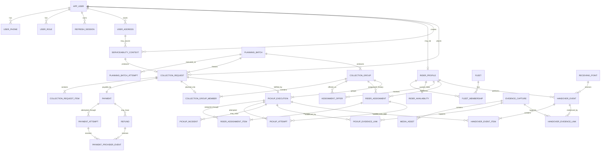

# ER Diagram

This file contains the consolidated relationship view for quick review.

For entity semantics, see `DOMAIN_MODEL.md`.

For physical table/constraint details, see `SCHEMA_DESIGN.md`.



## Cross-cutting reliability tables

These are intentionally not shown in the business ER graph:

```text
IDEMPOTENCY_RECORD
INBOX_MESSAGE
OUTBOX_EVENT
```

They are reliability infrastructure rather than business aggregates.

See `IDEMPOTENCY.md`.
