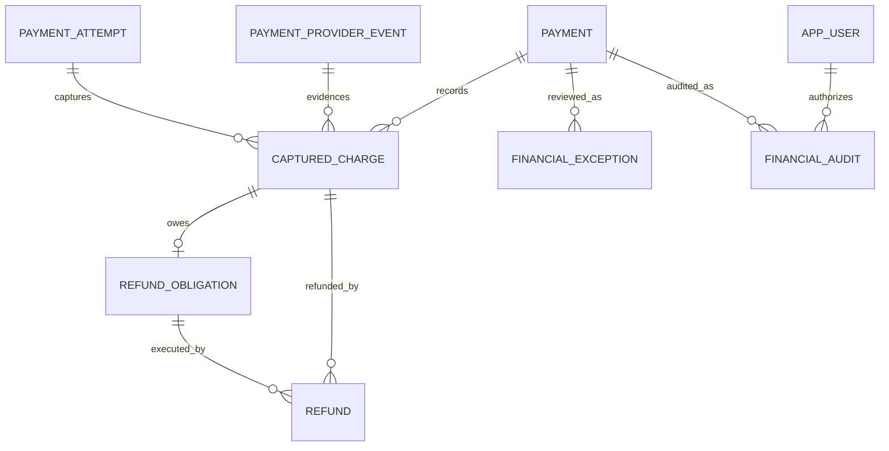
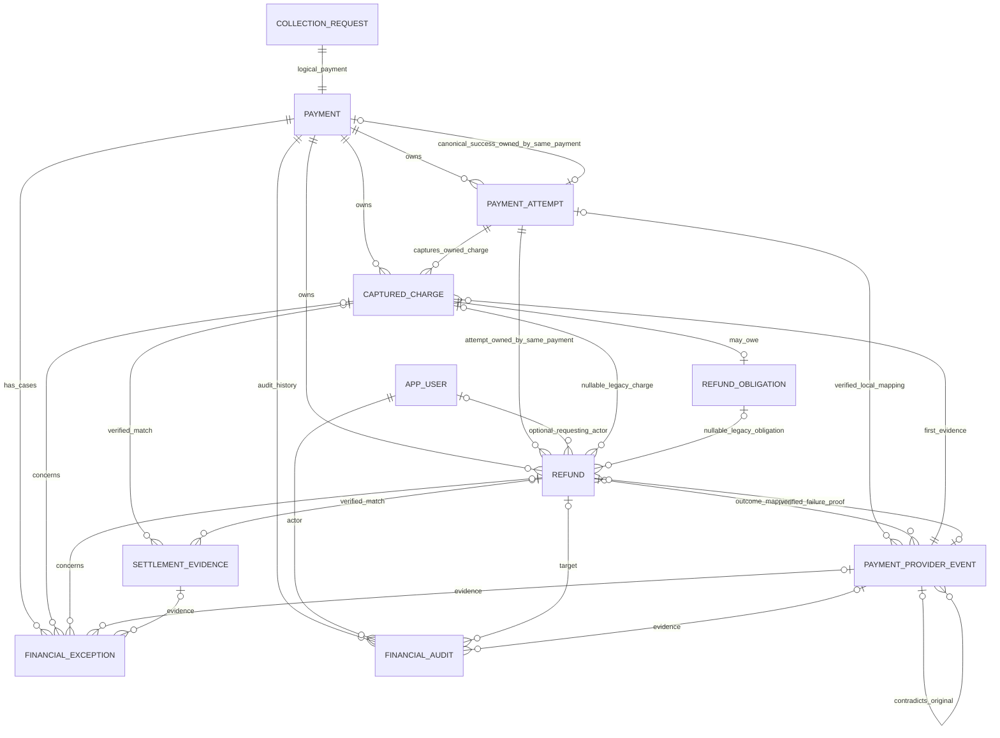

# ER Diagram

This file contains the consolidated relationship view for quick review.

For entity semantics, see `DOMAIN_MODEL.md`.

For physical table/constraint details, see `SCHEMA_DESIGN.md`.

```mermaid
erDiagram
    APP_USER ||--o{ USER_PHONE : has
    APP_USER ||--o{ USER_ROLE : has
    APP_USER ||--o{ REFRESH_SESSION : owns
    APP_USER ||--o{ USER_ADDRESS : saves
    APP_USER ||--o| RIDER_PROFILE : may_be

    APP_USER ||--o{ SERVICEABILITY_CONTEXT : creates
    USER_ADDRESS ||--o{ SERVICEABILITY_CONTEXT : may_source

    APP_USER ||--o{ COLLECTION_REQUEST : places
    SERVICEABILITY_CONTEXT ||--o| COLLECTION_REQUEST : produces
    COLLECTION_REQUEST ||--|{ COLLECTION_REQUEST_ITEM : contains

    COLLECTION_REQUEST ||--|| PAYMENT : payable_by
    PAYMENT ||--o{ PAYMENT_ATTEMPT : attempted_through
    PAYMENT_ATTEMPT ||--o{ PAYMENT_PROVIDER_EVENT : receives
    PAYMENT ||--o{ REFUND : may_have
    REFUND ||--o{ PAYMENT_PROVIDER_EVENT : receives

    PLANNING_BATCH ||--o{ PLANNING_BATCH_ATTEMPT : executed_as
    PLANNING_BATCH ||--|{ COLLECTION_REQUEST : freezes
    PLANNING_BATCH ||--|{ COLLECTION_GROUP : produces
    COLLECTION_GROUP ||--|{ COLLECTION_GROUP_MEMBER : contains
    COLLECTION_REQUEST ||--o| COLLECTION_GROUP_MEMBER : planned_into

    FLEET ||--o{ FLEET_MEMBERSHIP : has
    RIDER_PROFILE ||--o{ FLEET_MEMBERSHIP : joins
    RIDER_PROFILE ||--|| RIDER_AVAILABILITY : current_state

    COLLECTION_GROUP ||--o{ ASSIGNMENT_OFFER : offered_as
    RIDER_PROFILE ||--o{ ASSIGNMENT_OFFER : receives

    COLLECTION_GROUP ||--o{ RIDER_ASSIGNMENT : assignment_history
    RIDER_PROFILE ||--o{ RIDER_ASSIGNMENT : performs

    COLLECTION_REQUEST ||--o| PICKUP_EXECUTION : fulfilled_by
    COLLECTION_GROUP ||--|{ PICKUP_EXECUTION : groups

    RIDER_ASSIGNMENT ||--|{ RIDER_ASSIGNMENT_ITEM : contains
    PICKUP_EXECUTION ||--o{ RIDER_ASSIGNMENT_ITEM : assigned_through

    PICKUP_EXECUTION ||--o{ PICKUP_ATTEMPT : attempted
    RIDER_ASSIGNMENT ||--o{ PICKUP_ATTEMPT : performed_under
    PICKUP_EXECUTION ||--o{ PICKUP_INCIDENT : may_raise
    RIDER_ASSIGNMENT ||--o{ PICKUP_INCIDENT : attributed_to

    APP_USER ||--o{ EVIDENCE_CAPTURE : captures
    EVIDENCE_CAPTURE ||--o| MEDIA_ASSET : has_original
    PICKUP_EXECUTION ||--o{ PICKUP_EVIDENCE_LINK : evidenced_by
    EVIDENCE_CAPTURE ||--o| PICKUP_EVIDENCE_LINK : may_support

    RECEIVING_POINT ||--o{ HANDOVER_EVENT : receives
    RIDER_PROFILE ||--o{ HANDOVER_EVENT : performs
    HANDOVER_EVENT ||--|{ HANDOVER_EVENT_ITEM : contains
    PICKUP_EXECUTION ||--o{ HANDOVER_EVENT_ITEM : handed_over_by

    HANDOVER_EVENT ||--o{ HANDOVER_EVIDENCE_LINK : evidenced_by
    EVIDENCE_CAPTURE ||--o| HANDOVER_EVIDENCE_LINK : may_support
```



Phase 1L creates exactly one pickup or handover link per EvidenceCapture through its
transaction-owned service. Each link table has `UNIQUE(evidence_capture_id)`; no polymorphic target
columns or cross-table trigger are used. MediaAsset is an independent optional storage lifecycle.

Phase 1M freezes the media relationship as zero or one original `MediaAsset` per
`EvidenceCapture`, enforced by `UNIQUE(media_asset.evidence_capture_id)`. Derived representations
remain future work.

Phase 1O implements the identity relationships at the top of the graph. `user_phone` permits one
active verified phone per user and one active owner per keyed phone lookup. `user_role` retains
grant/revocation history with active uniqueness per role. `refresh_session` permits multiple fixed-
expiry, independently revocable sessions per user and stores only a unique SHA-256 credential
verifier.

## Cross-cutting reliability tables

Phase 1R `AUTHENTICATION_CHALLENGE` is a standalone authentication-intent root before user
resolution, with no AppUser FK. It binds a protected phone identity to a transaction-bound provider
reference; its public challenge UUID is separate. Only committed login consumes it. Its lifecycle
and constraints are defined in `SCHEMA_DESIGN.md`.

These are intentionally not shown in the business ER graph:

```text
IDEMPOTENCY_RECORD
INBOX_MESSAGE
OUTBOX_EVENT
```

They are reliability infrastructure rather than business aggregates.

See `IDEMPOTENCY.md`.

Phase 2 Batch B preserves all financial relationships: one logical Payment per collection,
attempt history, provider events and canonical-charge Refunds. Nullable authenticated capture
reference/amount/currency on PaymentProviderEvent retain additional-charge reconciliation facts;
they do not introduce a second financial aggregate or relax the canonical refund/balance invariant.
`PENDING_PAYMENT -> CANCELLED` is now an approved lifecycle edge, alongside accepted cancellation.
Cancellation compensation and later canonical capture use the existing Refund/outbox relationship.


## Phase 2 charge accounting extension



Migration 0020 adds these typed relationships. Legacy Refund links remain nullable until
verified; no generic polymorphic financial references or guessed backfill are introduced.
Charge-level bounds supersede the historical Batch B combined canonical-only cap.

## Migration 0021 financial evidence and ownership relationships



Composite Attempt/Payment ownership FKs protect canonical success, captures and refunds.
All nullable endpoints above denote optional real FKs, including unmatched external settlement
observations. FinancialScanCheckpoint is standalone account/window control progress, unique by
provider/account/kind, without a polymorphic entity reference. Inbox, Outbox and IdempotencyRecord
remain cross-cutting infrastructure. No relationship uses cascading financial deletion.
