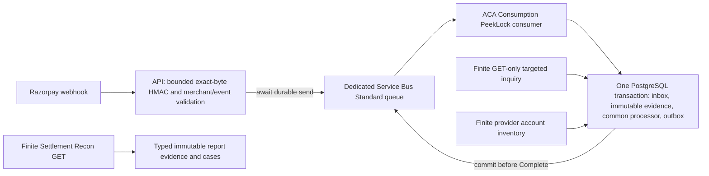

# Phase 2 financial correctness closure

## Authority and pre-implementation assessment — 2026-10-10

Repository: `C:\Users\91956\Tirodhan\tirodhan`; branch
`phase2/customer-financial-cancellation`; base
`5275963c0089b4583aa9b499540ff5cfa7b096fd`; clean tracked/untracked preflight;
migration head `0020_financial_reconciliation`. This assessment precedes code,
schema and Terraform changes. The previous completion report is immutable history.
The pasted closure request is the implementation authority. The reconciled database
proposal expressly requires owner review; the industry research supplies recommendations,
not Razorpay guarantees. The closure request approves queued ingress and the narrow
financial controls below, superseding older exclusions in ADR-005.

Classification abbreviations: **A** already implemented (verification recorded below);
**D** implemented but defective; **P** partially implemented; **M** missing;
**B** blocked by provider/environment evidence; **N** not required.
Evidence type: **CODE** demonstrated source defect; **POLICY** owner-approved rule;
**CONTRACT** official provider documentation; **OPS** account/deployment confirmation.
All paths below are repository-relative, rooted at the absolute repository above.

| Requirement (Parts 2–11) | Before | Exact evidence and required change | Basis |
|---|---|---|---|
| 2.1 platform, money, UUID and finite jobs | A | `main.create_app`, `db/values.py`, `payments/models.py`, `workers/financial_reconciliation.py`; retain modular API, PostgreSQL, ACA consumption and Service Bus Standard | POLICY |
| 2.2 selective concurrency, no blanket versions | A/N | `payments/service.process_authenticated_payment_event`, `reconciliation._approve_refund`; Payment-first locks; `customers/models.UserAddress.version` remains selective; no new universal version/history | POLICY |
| 2.3 one Payment, attempts and distinct charges | A | `uq_payment_request`, `uq_captured_charge_identity`, `accounting.record_charge`; tests `test_additional_charge_duplicate_events_and_multi_charge_cancellation` | POLICY |
| 2.3 durable obligations, manager replacement, financial truth versus booking | A | `RefundObligation`, `FinancialAudit`, `reconciliation.approve_refund`, expiry/cutoff tests; preserve rules | POLICY |
| 3 ingress authenticate → durable queue → acknowledge | D/M | `api/routes/payments.post_provider_webhook` directly calls financial processor and depends on DB factory; replace with awaited minimal-envelope send | CODE/POLICY |
| 3 exact-byte HMAC, account and size validation | P | `razorpay.authenticate_webhook`; HMAC/account validation exists; HTTP body currently unbounded; add bounded streaming read and consumer schema | CODE/CONTRACT |
| 3 dedicated queue and exclusive trusted sender | M | `infra/terraform/nonprod/locals.tf`, `service_bus.tf`, `rbac.tf`, `container_apps.tf`; existing shared identity has sender/receiver on every queue; exclude new queue from these assignments, use API-only sender and worker-only receiver identities | POLICY |
| 3 PeekLock, transactional evidence/inbox/outbox, crash/redelivery | P | `refund_consumer`, reliability inbox/publisher and `workers/refunds` supply patterns; add financial webhook consumer, commit before complete | POLICY/CONTRACT |
| 3 conflicting event ID/hash | D | `service.process_authenticated_payment_event` returns existing event after unique conflict without hash comparison; retain contradictory observation with original-event FK and block unsafe effects | CODE |
| 3 poison, DLQ, original identity, recoverable unmatched | P | broker max_delivery_count=10; existing adapters bounded; retain full minimal references for unmatched evidence; explicit worker DLQ and replay contract | POLICY |
| 3 five-second acknowledgement and API cold start | B | API min_replicas=0, Razorpay five-second timeout; measure real ingress/cold start; no minimum-replica spending change authorized | CONTRACT/OPS |
| 4 persisted/wire refund identity | D | `refunds.create_refund` stores `refund:<uuid>`; `razorpay.initiate_refund` ignores argument and sends `rf_<hex>`; normalize only provably deterministic legacy Razorpay keys, preserve effective wire identity | CODE/CONTRACT |
| 4 identical original POST and uncertain recovery | P | native header/body and `refund_consumer` exist; prioritize verified GET on redelivery; no automatic replacement | POLICY/CONTRACT |
| 4 aged replay and 409 | D/B | `execute_refund_provider_call` resumes indefinitely; public native-idempotency docs omit retention; gate ambiguous POST replay on explicit confirmed bounded policy; no new key for 409 | CODE/OPS |
| 4 refund correlation receipt/notes/refund/payment/money/account | P | webhook validates disagreement; unknown-ID GET matches receipt and tolerates missing note; require both internal correlators for unknown-ID inventory recovery; preserve known-ID validation | POLICY |
| 5 pending versus processed and stale outcome precedence | A | `_process_refund_event`, `inquire_target`, tests of processed-before-pending/failure; maintain one processor | POLICY |
| 5 failed status versus definitive non-payability | A/B | finality flag defaults false; fresh API evidence and complete inventory in `_approve_refund`; universal method guarantee unconfirmed | POLICY/OPS |
| 5 age/threshold never authorizes replacement | A | `reconcile_batch` opens exception, never POST/replacement; retain | POLICY |
| 6 preclaimed batch lease expiry | D | all deadlines assigned before sequential GET; claim just before each target I/O | CODE |
| 6 superseded release terminates unrelated work | D | `reconcile_batch` raises RuntimeError on mismatched token; skip conditional stale release | CODE |
| 6 payment starvation with batch_size=1 | D | refunds selected first with min quota=1; use oldest-due cross-kind selection and just-in-time SKIP LOCKED claim | CODE |
| 6 actual PostgreSQL race/commit/provider crash coverage | P | existing financial/cancellation/planning suites cover core races; add controlled lease takeover, stale pending, queue commit crashes and manager versus success | POLICY |
| 7 endpoint-specific pagination/completeness | D/P | `_collection`, `_charge_refunds`, `_find_order` reject >=100; refund/account inventories document count/skip; order-payments does not. Exhaust supported pages with finite budgets; no undocumented order completeness claim | CONTRACT |
| 7 exactly full pages, duplicates, unstable offsets | M | no resumable provider inventory scan; persist account/window/offset and repeat overlapping closed windows; no global snapshot guarantee | POLICY/OPS |
| 7 missed additional capture after Payment success | M | due sweep stops terminal attempts; add provider-to-local account scan feeding shared processor | POLICY |
| 7 Dashboard/unknown refunds and contradictions | P/M | manager inventory checks block approval, but no provider discovery; retain minimal unmatched provider evidence and block charge payout for external operations | POLICY |
| 7 new checkpoint justification | M | Inbox holds message IDs, Outbox local domain events, Attempt/Refund only known local targets; none can persist account-wide closed window and page offset. A typed scan checkpoint is necessary; no generic history table | CODE |
| 8 transaction versus inventory versus settlement control | P/M | transaction control exists; inventory and settlement finite controls missing; implement documented API portion only | POLICY |
| 8 settlement grain, money, fees/tax/adjustments and replay | M/B | official `/settlements/recon` supplies entity_id/type/settlement_id, debit/credit/amount/fee/tax/currency; no existing typed storage can retain these fields. Add append-style typed settlement evidence, never capture=net-payout assumption | CONTRACT/OPS |
| 8 unknown/missing expected settlement population | M/B | report completeness lag/membership not documented universally. Detect actual unknown/mismatch; missing expected requires explicit verified due/membership input, never age alone | POLICY/OPS |
| 8 late adjustments and investigation retention | M | preserve observation hash and prior evidence rather than overwrite; re-scan configured report days | POLICY |
| 8 dispute/chargeback ingestion and double credit | M | actionable webhook allow-list excludes documented payment.dispute events; append evidence, block charge payouts, durable manager case; no auto-refund/status rewrite | CONTRACT/POLICY |
| 8 undocumented refund.reversed | N/B | no such event in Payments refund API contract; do not invent one; provider question retained | CONTRACT/OPS |
| 9 FKs and nullable legacy links | A/P | financial models and migrations 0016–0020 use non-cascading real links; `Payment.successful_attempt_id` lacks DB FK; validate and add narrow ownership constraint if populated migration evidence supports it | CODE |
| 9 per-charge aggregate reservation/concurrent inserts | P | 0020 trigger locks charge, but READ COMMITTED statement snapshot correctness must be tested with independent direct inserts; strengthen only if demonstrated | POLICY |
| 9 immutable captures and audit retention | P | service compares facts but DB allows updates; enforce immutable capture economic identity and append-only audit/evidence retention; no universal versions | CODE/POLICY |
| 9 migration and raw baseline discrepancies | A | retain PostGIS and migration-0007 indexes; new migration only for required checkpoint/report facts/identity safeguards; populated downgrade/upgrade and raw/filtered comparisons | POLICY |
| 10 focused/full scientific validation | P | previous 959/1 is historical; fresh focused baseline running; final new tests, complete regression/static/migration/Terraform results to follow | POLICY |
| 11 native key retention, method finality, reversal semantics | B | public documentation does not supply these account guarantees; default safety gates remain closed | OPS |
| 11 webhook IDs/order/ack/retries | A/B | official best practices: five seconds, retries 24h, disabled after failures, unique event ID, no order guarantee; actual throughput/cold starts need account/nonprod tests | CONTRACT/OPS |
| 11 endpoint pagination, report access/lag, Dashboard visibility/account rotation | P/B | documented parameters verified independently; account-wide stability, report enablement, lag, rates and cross-account rotation require exact support questions | CONTRACT/OPS |

Implementation and verification sections are appended after this immutable pre-change assessment.

## Executive conclusion

This closure implements queued authenticated ingress, durable contradictory/unmatched evidence,
GET-first refund recovery, bounded account inventory and settlement controls, dispute holds,
fair reconciliation leases and stronger relational safeguards. It retains the existing financial
processor and approved commercial policies. Verification below distinguishes actual PostgreSQL
effects from synthetic Razorpay HTTP contracts. Real provider behavior and deployed infrastructure
are not verified. This branch is for independent architectural review, not live-money release.

The most material additional defect was established experimentally: two PostgreSQL sessions
could reserve 600 minor units against a 500-unit charge when the second operation used its known
legacy null-charge mapping. The mapped-only case passed; the legacy case failed (1 passed,
1 failed, 19 deselected; 12.26 seconds). Migration 0021 guards both with the same charge lock and
aggregate cap. No existing migration, PostGIS artifact or historical completion report is edited.

## Final requirement-to-implementation matrix

The numbered rows correspond exactly, in order, to the 41 pre-change assessment rows above;
together the tables supply decision, repository/research source, existing behavior, actual gap,
implementation, test evidence, closure and remaining dependency for Parts 2–11.

Test aliases below are rooted at this repository:

- **C**: `tests/integration/test_financial_correctness_closure.py`.
- **F**: `tests/integration/test_financial_reconciliation.py`.
- **U**: `tests/unit/test_financial_provider_boundaries.py`.
- **R**: `tests/integration/test_razorpay_refunds.py` and `tests/unit/test_razorpay.py`.
- **P**: `tests/integration/test_razorpay_payments.py`.
- **X**: `tests/integration/test_customer_financial_cancellation.py`.
- **T**: `tests/unit/test_nonprod_substrate.py`, plus Terraform 1.13.5 validation.

LOCAL denotes implemented behavior verified by the final checks below. EXTERNAL denotes a
safe local implementation whose provider/account/deployment guarantee remains blocked.
NOT REQUIRED denotes an expressly excluded architectural mechanism. Provider questions Q1–Q15
below cover every Part 11 question separately.

| Row / requirement | Final code, migration or preserved mechanism | Regression evidence | Closure / remaining dependency |
|---|---|---|---|
| 1 platform, money, UUID, finite jobs | FastAPI monolith, integer money, UUIDv7, existing PostgreSQL and finite ACA entry points retained | full regression; T budget assertions | LOCAL; cloud enablement separate |
| 2 selective concurrency | Payment-first locks; no generic version/history migration; existing address version unchanged | F overlapping jobs/managers; X cancellation/freeze races | LOCAL; blanket versions NOT REQUIRED |
| 3 logical versus actual charges | `service.process_authenticated_payment_event` and `accounting.record_charge` retain distinct actual payment IDs | F `test_additional_charge_duplicate_events_and_multi_charge_cancellation`; C missed second capture | LOCAL |
| 4 debt, manager, booking truth | RefundObligation, live manager proof/locks, FinancialAudit and accepted policies retained | F expiry/historical/replacement cases; X late captures | LOCAL; Q1–Q2 gate replacement finality |
| 5 queue-before-ack | `api/routes/payments.post_provider_webhook`, `webhook_queue.webhook_publisher_runtime`; no DB dependency | U `test_http_ack_waits_for_broker_and_exact_replay_keeps_minimal_identity`; P lifespan test proves DB unchanged before consume | LOCAL; durable Azure acceptance must be exercised |
| 6 exact HMAC/account/bounds | original authentication retained; streamed 1 MiB cap, strict 4096-byte envelope and account fingerprint | U invalid signature/event ID/oversize/timeout; C account/provenance poison variants; existing P account mismatch | LOCAL |
| 7 trusted sender | dedicated queue, two queue-scoped identities; shared runtime RBAC excludes it; API-only sender attachment | T `test_financial_webhook_trust_uses_exclusive_queue_scoped_workload_identities` | EXTERNAL; inspect deployed/inherited RBAC before enablement |
| 8 atomic consumer | `workers.financial_webhooks`, `handle_webhook_delivery`, processor inbox/evidence/domain/outbox transaction | C lost Complete + concurrent replays; injected pre-commit crash rollback and recovery | LOCAL; real PeekLock/lock loss test outstanding |
| 9 hash contradiction | derived unique evidence links original through contradicted_event_id, preserves first facts and opens hold | C `test_same_event_id_changed_hash_retains_contradiction_and_blocks_charge` | LOCAL |
| 10 poison/DLQ/unmatched | typed envelope rejection, abandon on transient failure; minimal external refs retained; same evidence remaps; earlier refund/report evidence attaches before compensation | C poison variants; unmatched order-later; external refund before extra capture | LOCAL; DLQ operations preserve original ID/subject/body; no automated untrusted replay tool |
| 11 ack/cold starts | send timeout <=4s, retries disabled; API min replicas remains zero | U held-send/timeout; T scale-to-zero | EXTERNAL; Q11, measured ingress/cold-start p95/p99/burst behavior |
| 12 wire identity | `create_refund` stores native key; 0021 normalizes exact old neutral keys; arbitrary legacy keys held | R header/body identity; C populated submitted-key migration roundtrip | LOCAL; account verification for unprovable keys |
| 13 uncertain recovery | `execute_refund_provider_call` GET-first, original UUID/key/body, no automatic replacement | C lost POST response recovered by GET with no second POST; R/X crash/redelivery one external effect | LOCAL; remote mocks model documented contract, not retention guarantee |
| 14 age/409 | unconfirmed/expired native replay window opens case and refuses POST; 409 remains uncertain | C aged/unconfirmed replay variants; R HTTP 409/body tests | EXTERNAL; Q4–Q6 confirmation before configuring window |
| 15 refund correlation | known ID validates payment/money/currency/account; unknown ID requires both original receipt and UUID note; disagreement fails closed | U both-correlator conflicts; R webhook original identity and mismatch cases; F reported-reference mismatch | LOCAL; Q7/Q9 delivery/visibility guarantees |
| 16 pending/processed precedence | one existing outcome processor; no time-based processed state | F/R stale pending/failure after success and pending after verified failure; C stale lease observation | LOCAL |
| 17 definitive failure | default finality false; API_INQUIRY proof, complete mapped inventory and correct balance required | F `test_failed_status_without_confirmed_finality_never_releases_obligation`; manager replacement tests | EXTERNAL; Q1–Q2, all enabled methods must be confirmed |
| 18 age is review only | targeted scheduled GET and unresolved cases retained; never scheduled POST/new Refund | F five-minute/expired/unresolved cases; C aged replay; GET-only mock transports | LOCAL |
| 19 lease preclaim | `reconcile_batch` takes each target immediately before its GET | C slow GET lease takeover; F overlapping jobs and expired claim | LOCAL; explicit lease and provider-timeout configuration |
| 20 stale release | `_release_claim` token mismatch returns without clearing newer state; subsequent batch work continues | C `test_lease_takeover_during_get_stale_release_does_not_clobber_or_stop_next_work` checks unrelated target count | LOCAL |
| 21 fairness | oldest due target across both operation kinds, including batch size one | C `test_batch_one_oldest_due_payment_is_not_starved_by_refund_population` | LOCAL |
| 22 real concurrency | no DB transaction/connection across provider HTTP; existing manager/cancellation locks retained | F overlapping managers and commit crash; X physical lock races; C two backend PIDs, queue commit/ack loss | LOCAL; actual provider crash behavior remains external |
| 23 documented pagination | `_exhaust_pages`, account payments/refunds count=100/skip; order-payment full pages cross-check account API; recon count=1000 | U exact 100/101/203, bounded exhaustion; C full report page resumes | LOCAL supported contract; Q8 immutable coverage NOT VERIFIED |
| 24 instability/resumption | finite page budgets, duplicate identity checks; checkpoint persists rolling passes and offsets; closed windows repeat then overlap | U duplicate/conflict/oversized/unstable/budget variants; C new record inserted ahead of scan offset | LOCAL; late visibility outside overlap needs historical replay and Q8/Q14 |
| 25 terminal logical payment inventory | `inventory.discover_inventory` feeds common processor regardless of local successful status | C missed second capture after successful Payment, one acceptance | LOCAL |
| 26 external refunds/contradictions | provider facts are retained without inventing local execution; known charge cases/holds; reviewable unmatched and settlement inventories | C Dashboard discovery and refund-before-capture ordering; F external refund blocks manager payout | LOCAL; Dashboard restrictions/visibility Q9 |
| 27 checkpoint justification | FinancialScanCheckpoint only account/kind/window/offset/pass/lease progress; Inbox/Outbox cannot supply it | C full page progress and stable-pass checks; schema comparison | LOCAL; retention and start epoch operator-owned |
| 28 independent controls | existing transaction inquiry, new account inventory and independent typed report matching; all use existing PG | F transaction control; C account/report controls; finite job wiring | LOCAL documented/mocked portion; actual accounting EXTERNAL |
| 29 settlement grain/net | `settlement.record_settlement`, 0021 typed immutable fields; explicit confirmed fee-includes-tax rule; no rule means MATCHED_GROSS only | C gross/fee/tax/net mismatch, replay and explicit policy reassessment | EXTERNAL; Q14 availability, fee/tax contract and actual merchant reports |
| 30 unknown/missing expected | unknown movement retained; known mismatches open cases; `check_expected_settlement` requires verified membership/due/coverage, bounded batch | C missing expected/no coverage/future due, unknown report transaction | EXTERNAL; no guessed T+N producer or automatic completeness claim; Q14 |
| 31 late adjustments | immutable distinct observations/assessments, settlement case links, configured historical/recent-day scan | C changed fee/adjustment preserves earlier rows; report replay | EXTERNAL; retrospective visibility beyond revisit window Q14 |
| 32 dispute/double credit | documented dispute webhook allow-list; immutable event facts and case/obligation hold; no auto-refund/status rewrite | C `test_dispute_after_refund_preserves_capture_and_blocks_double_credit`; existing provider validation | LOCAL minimal ingestion; Q13 commercial/account resolution manual |
| 33 reversal event invention | no refund.reversed handler/status; unknown provider events cannot perform refund effects | allow-list and existing U/P ignored-event tests | NOT REQUIRED; FAQ ambiguity Q3/Q13 |
| 34 FK graph/legacy | 0021 composite successful/capture/refund Attempt ownership; nullable old charge links preserved; no cascade | C ownership FK and actual pg_constraint deletion rules; both migration roundtrips | LOCAL; inconsistent real legacy ownership must be reviewed before migration |
| 35 aggregate reservations | 0021 replaces only reservation function; canonical legacy and mapped operations serialize on same actual charge | C mapped and legacy direct two-session 300+300 versus 500 experiment | LOCAL; no guessed historical backfill |
| 36 immutable truth/audit | capture, submitted Refund, provider observation and manager/report audit triggers | C direct UPDATE/DELETE rejected; original amounts/key preserved | LOCAL; approved retention maintenance/exports separate |
| 37 migrations/drift | only new 0021; original finance rows and same native wire key survive; preserve exact three old discrepancies | C 0021/0020 populated roundtrip; F earlier-history roundtrip; raw/filtered audit below | LOCAL; production data preflight/export required |
| 38 scientific validation | focused, complete regression, lint/format/type, migration/schema and exact pinned Terraform checks | dated results below; failures/interrupted work explicitly recorded | LOCAL checks only; no cloud/live evidence |
| 39 retention/finality/reversals questions | Q1–Q6 and Q15 primary documentation review; fail-closed settings | targeted gate tests; dated provider register | EXTERNAL, no support message sent |
| 40 webhook contract | Q11 official at-least-once IDs/retry/order/ack behavior; DB uniqueness supplies economic safety | queue crash/replay tests; send timeout | EXTERNAL operational throughput/deactivation recovery |
| 41 pagination/report/account questions | Q7–Q10/Q12–Q14 endpoint-specific docs and explicit unknown guarantees | HTTP fixtures, account mismatch and finite bounded controls | EXTERNAL merchant confirmations and nonprod access |

## Consolidated financial design



The API 2xx means **queued**, not payment accepted. The private provider endpoint returns a
deterministic `receipt_id` and `processing_status=QUEUED`; customer/mobile financial DTOs and
manager mutation contracts retain their existing enums and authorization rules. Added manager
GETs `/v1/manager/financial/provider-events` and `/v1/manager/financial/settlement-evidence` use live MANAGER checks,
UUID cursors and 1..100 limits; existing payment detail includes settlement case references.
No manager status override, auto-repricing/reopening, customer notification deployment or
extra payment state machine is added.

The envelope contains allow-listed financial identifiers, statuses, integer money, currency,
account fingerprint and raw-body hash, without raw JSON/contact/card/address/notes. A sender
must already have authenticated exact bytes. Its provenance marker is not a cryptographic
replacement for HMAC: trust also requires the exclusive queue sender grant. The shared runtime
identity can operate existing queues but cannot send/receive this one. Azure control-plane
owners remain capable of changing RBAC; deployed inherited grants require inspection.

The consumer uses prefetch zero, bounded lock renewal, explicit PeekLock and commit-before-
Complete. Poison schema/account/provenance/receipt mismatches dead-letter with a fixed reason;
transaction failures abandon. A lost broker completion after commit may redeliver: domain/event
and inbox uniqueness preserve one capture, acceptance and obligation. Same event ID with changed
body hash creates another minimal contradictory record linked to the original. Valid unmatched
events commit references instead of disappearing. Earlier unmatched refund/dispute/report
evidence is considered when its actual capture becomes known, so ordering cannot authorize a
second payout. Verified capture is retained while unsafe compensation moves to investigation.

Payment precedes overlapping Attempt, Charge, Refund and request/work-unit locks. Scheduling
transactions lock only target/checkpoint rows and never request Payment. Provider HTTP is outside
DB transactions/connections. Per-charge bounds count all payable mapped and known canonical
legacy reservations; FAILED releases nothing without verified non-payability. Trigger outcome
updates do not suppress contradictory external success. The extended actual graph is documented
in [ER_DIAGRAM.md](ER_DIAGRAM.md) and [SCHEMA_DESIGN.md](SCHEMA_DESIGN.md).

Refund creation stores `rf_<Refund UUID hex>` for Razorpay. Receipt/notes/normal speed and amount
remain identical for the original operation. On uncertainty the worker queries known rfnd ID or
supported charge inventory first. Unknown-ID recovery requires original receipt **and** internal
UUID note plus payment/money/currency/account validation. Partial correlation disagrees → uncertain,
never amount-only matching. An absent operation permits native POST replay only within an
explicitly confirmed retention window measured from the original submission. The timestamp cannot
reset. An unconfirmed/expired window creates an investigation case, preserves liability and
prevents POST. Unprovable historical keys remain held, not renamed. Scheduled reconciliation
never calls POST; only an already-authorized Refund worker executes an initial/replayed operation.

Account inventories use supported count=100/skip/from/to pages, bounded work, account-bound
deterministic observation hashes and durable offsets. Exhausted closed windows must produce two
matching passes before advancement, then overlap. Order-payment endpoints are not given invented
query parameters/completeness guarantees. Direct order results establishing capture are usable;
full pages or all-failed populations require supported account-inventory cross-checks. Different
merchant responses cannot silently bind an old financial target. No repeated-pass algorithm can
prove an undocumented immutable provider snapshot: unstable/full-budget scans remain incomplete;
late records outside overlap require operator-driven historical checkpoint replay.

Settlement Recon is independent evidence, with count=1000/skip and configured report timezone,
historical start and recent-day revisit horizon. One historic day plus at most 31 recent days and
explicit page budgets bound each finite job. A checkpoint exhausts API pages, not accounting
finality. `MATCHED_GROSS` deliberately omits a net-completeness claim when fee-tax inclusion is
unconfirmed. Confirmed inclusion/exclusion rules compare reported net direction and fees/tax;
changed rules or newly known mappings append another assessment. Transfer/adjustment and dispute
movements require investigation. Missing expected records require externally verified membership,
due time and coverage; the local control is implemented/tested, but no unverified production
membership producer is wired. Unknown report entities without a Payment remain durable typed
review records rather than fake Payment/Refund rows.

## Explicit financial invariants

1. One original Refund identity represents one intended provider economic operation; original
   native key/body are preserved. Remote deduplication after long delays is not presumed.
2. Retries/redelivery do not reserve or pay a second refund. Uncertain prior operations reserve
   their balance; only independently verified non-payable failure permits an audited replacement.
3. Provider/payment identity uniquely accounts one capture; different captured IDs are separate
   actual charges, even when logical Payment already succeeded.
4. Booking acceptance requires verified eligible capture and happens once. Late money is retained
   with a case, without silently accepting, reopening, repricing or rescheduling the request.
5. Managers cannot override financial status. Approval requires fresh provider facts, complete
   mapped inventory, live role, correct remaining reservation and immutable command audit.
6. Provider ambiguity, elapsed time, exhausted retries or missing webhook never authorizes a new
   economic operation. A dispute/chargeback plus refund is a double-credit investigation hold.
7. No completed-settlement claim exists without real provider settlement evidence and verified
   coverage. Local mocks demonstrate processing and controls, not merchant accounting completeness.

## Official provider question register — independently checked 2026-10-10

Only current primary Razorpay documentation below is contract evidence. Research attachments and
other providers are not guarantees. No real authenticated provider call, support message or payment
was made. Exact account questions below are for the owner to raise; none is silently assumed.

| ID / question | Evidence and conclusion | Classification | Exact practical unresolved question / temporary behavior |
|---|---|---|---|
| Q1 Is API-observed failed normal refund non-payable for every enabled method? | Native refund docs describe pending/processed/failed, but do not establish universal non-payable failed finality. [Normal idempotent refund](https://razorpay.com/docs/api/refunds/normal-refunds-idempotent/) | ACCOUNT-SPECIFIC CONFIRMATION REQUIRED | For our merchant and each enabled payment method, does API-observed normal `failed` irrevocably mean no customer credit? Finality flag stays false; balance remains reserved. |
| Q2 Can failed later process under same ID? | No reviewed primary contract rules out this transition for every enabled rail. [Refund entity](https://razorpay.com/docs/api/refunds/entity/) | ACCOUNT-SPECIFIC CONFIRMATION REQUIRED | Can an rfnd ID previously returned as failed later become processed or credit the customer, including bank retries? Preserve later truth and block duplicate credit. |
| Q3 What exposes reversed refunds? | FAQ mentions Reversed through final updates while also describing issued refunds as irreversible; no concrete reversed event/status contract is established. [Refund FAQs](https://razorpay.com/docs/payments/refunds/faqs/) | DOCUMENTATION AMBIGUOUS | What exact entity field/value, webhook/API and accounting movement represent a reversed refund in our Payment Gateway product? Supply sample payload and finality semantics. No invented refund.reversed handler. |
| Q4 Native key retention? | Public native endpoint gives key/body behavior without a retention duration. [Native idempotency](https://razorpay.com/docs/api/refunds/normal-refunds-idempotent/) | ACCOUNT-SPECIFIC CONFIRMATION REQUIRED | What guaranteed retention duration and scope applies to X-Refund-Idempotency, including key rotation and test/live mode? Replay window remains unset. |
| Q5 Extended outage/redelivery replay safety? | Network retry guidance does not prove indefinite deduplication. [Native idempotency](https://razorpay.com/docs/api/refunds/normal-refunds-idempotent/) | ACCOUNT-SPECIFIC CONFIRMATION REQUIRED | After a lost response and broker/DLQ delay exceeding that duration, how can we prove original operation absence/non-payability before another economic operation? GET first; aged replay blocked. |
| Q6 Same-key 409? | 409 covers body conflict and concurrent processing; generic suggestion to change key is unsafe for one original financial intent. [Native errors](https://razorpay.com/docs/api/refunds/normal-refunds-idempotent/) | DOCUMENTED AND VERIFIED (409 meaning); ACCOUNT-SPECIFIC CONFIRMATION REQUIRED (recovery guarantees) | Which read endpoint/correlation and retry interval resolves an in-progress original same-key operation without issuing a second refund? Preserve original key/body; uncertain plus GET, never rotate key. |
| Q7 Are receipt/notes always preserved in subscribed refund hooks? | Samples allow null receipt and do not guarantee our correlation note on every event. [Refund webhook payloads](https://razorpay.com/docs/webhooks/refunds/) | ACCOUNT-SPECIFIC CONFIRMATION REQUIRED | For refund.created/processed/failed, including Dashboard and delayed hooks, are receipt and tirodhan_refund_id notes unchanged/present? Provide omitted-field examples. Known rfnd mapping remains usable; unknown correlation fails closed. |
| Q8 Exact order/refund pagination completeness? | Charge refunds document count<=100/skip/from/to; order payments lacks an endpoint-specific pagination promise. Order lookup supports receipt. [Charge refunds](https://razorpay.com/docs/api/refunds/fetch-multiple-refund-payment/), [order payments](https://razorpay.com/docs/api/orders/fetch-payments/), [orders](https://razorpay.com/docs/api/orders/fetch-all/) | DOCUMENTED AND VERIFIED (listed parameters); ACCOUNT-SPECIFIC CONFIRMATION REQUIRED (snapshot/completeness) | Is order-payment output exhaustive above 100, and what ordering/visibility/snapshot guarantees apply to offset inventories during concurrent inserts? Use documented account cross-check; incomplete inventory cannot prove terminal failure. |
| Q9 Dashboard refund visibility everywhere? | Dashboard supports refunds; APIs list provider refunds, but universal cross-channel visibility/lag is unproved. [Dashboard](https://razorpay.com/docs/payments/payments/dashboard/), [all refunds](https://razorpay.com/docs/api/refunds/fetch-all/) | NOT TESTABLE WITHOUT PROVIDER ACCESS | Are all Dashboard refunds visible in GET account/charge inventories, subscribed hooks and recon, including creation/failed states; with what maximum lag? Discover and hold unknowns; restrict unsupervised Dashboard payouts. |
| Q10 Account identity/credential rotation? | APIs authenticate with merchant credentials; hook account IDs are visible, but account-specific rotation binding requires validation. [API authentication](https://razorpay.com/docs/api/authentication/), [webhook validation](https://razorpay.com/docs/webhooks/validate-test/) | ACCOUNT-SPECIFIC CONFIRMATION REQUIRED | Which stable merchant account_id binds our test/live keys, key rotation, historical reads and hooks? What secret overlap/signing rules apply to retried hooks during rotation? Configure stable account ID; legacy key fingerprints need verified mapping, not guessed rewrite. |
| Q11 Ack/retry/deactivation/availability? | Five-second response requirement, at-least-once delivery, unique event header, no delivery-order promise, exponential retry up to 24h and webhook disabling are documented. [Best practices](https://razorpay.com/docs/webhooks/best-practices/) | DOCUMENTED AND VERIFIED; NOT TESTABLE WITHOUT PROVIDER ACCESS (our availability) | Confirm subscriptions/reenablement/runbook and peak delivery profile for our merchant. Measure cold starts and bursts against five seconds. API stays minimum zero; no cost increase chosen implicitly. |
| Q12 Account-specific API and hook rates? | General docs specify 429 and backoff/jitter, without this merchant's numeric quotas. [API limits](https://razorpay.com/docs/api/understand/) | ACCOUNT-SPECIFIC CONFIRMATION REQUIRED | What per-endpoint/per-merchant sustained/burst quotas and webhook concurrency apply to payments/refunds/recon/disputes? What Retry-After policy applies? Bounded GETs, due backoff and no guessed production schedule. |
| Q13 Dispute/chargeback/reversal product effects? | Dispute events and GET APIs are documented, including loss deductions. Chargeback guidance discusses prior refund proof. [Dispute hooks](https://razorpay.com/docs/webhooks/disputes/), [entity](https://razorpay.com/docs/api/disputes/entity/), [GET](https://razorpay.com/docs/api/disputes/fetch/), [chargebacks](https://razorpay.com/docs/payments/refunds/chargeback) | DOCUMENTED AND VERIFIED (minimal ingestion); ACCOUNT-SPECIFIC CONFIRMATION REQUIRED (product/policy) | Which dispute phases, deduction/reversal/report effects and refund-after-chargeback restrictions apply to our rails/account? How is earlier refund proof used? Hold payout and manual review; no automatic second credit or invented reversal. |
| Q14 Recon access, lag, membership, completeness and late adjustment? | Recon documents typed payment/refund/transfer/adjustment, gross/debit/credit/fee/tax, settlement and flags; date query and count<=1000/skip. Merchant availability, timezone, universal fee-tax equation, membership/finality lag and retrospective completeness are unproved. [Settlement Recon](https://razorpay.com/docs/api/settlements/fetch-recon/) | NOT TESTABLE WITHOUT PROVIDER ACCESS; ACCOUNT-SPECIFIC CONFIRMATION REQUIRED | Is recon enabled in test/live for our merchant? Define report-day timezone, entity uniqueness/membership, fee-tax inclusion, due/hold rules, maximum visibility and retrospective-change horizon, exhaustive pagination and independently verified report completion. Report/fee switches and expected-population producer remain gated. |
| Q15 Maximum captured-payment age for fresh normal refund? | Native normal docs state payments older than six months cannot use normal refund. [Normal refund states](https://razorpay.com/docs/api/refunds/normal-refunds-idempotent/) | DOCUMENTED AND VERIFIED (published restriction); ACCOUNT-SPECIFIC CONFIRMATION REQUIRED (method/date semantics) | Confirm calendar age boundary, original provider timestamp and each enabled method's limit/alternative manual disposition. Preserve debt; do not interpret age-based rejection as universal replacement finality. |

Refund processing time is not a terminality timer. Payment fees/taxes are not automatically
reversed with a regular refund. [Refund FAQs](https://razorpay.com/docs/payments/refunds/faqs/)
No public source above establishes the needed bank-method finality or unlimited key retention.

Azure and PostgreSQL evidence checked on the same date: broker completion can fail after the
financial commit, so business idempotency must survive redelivery; poison/exhausted deliveries
use DLQ and broker duplicate detection cannot replace domain uniqueness. Row locking arbitrates
concurrent reservations. [PeekLock/settlement](https://learn.microsoft.com/en-us/azure/service-bus-messaging/message-transfers-locks-settlement),
[DLQ](https://learn.microsoft.com/en-us/azure/service-bus-messaging/service-bus-dead-letter-queues),
[deduplication](https://learn.microsoft.com/en-us/azure/service-bus-messaging/duplicate-detection),
[PostgreSQL locks](https://www.postgresql.org/docs/17/explicit-locking.html).

## Operational enablement and cost

1. Obtain the outstanding account confirmations above. Keep
   `TIRODHAN_RAZORPAY_NORMAL_REFUND_FAILURE_FINALITY_CONFIRMED=false` and
   `TIRODHAN_RAZORPAY_REFUND_REPLAY_WINDOW_SECONDS` unset until documented account evidence exists.
   Keep `TIRODHAN_FINANCIAL_SETTLEMENT_FEE_INCLUDES_TAX` unset until the recon net equation is
   confirmed. A synthetic test's confirmed 600-second replay window is not production advice.
2. Verify merchant activation, test/live separation, auto-capture, stable
   `TIRODHAN_RAZORPAY_ACCOUNT_ID`, API credentials, active webhook secret and subscriptions to
   payment.captured/authorized/failed, refund.created/processed/failed and the documented dispute
   hooks. Validate rotation of both API and webhook secrets, including historical account hashes
   and retained provider retry signatures. Do not log any keys or raw payloads.
3. Before the accepted staged deployment, migrate/verify 0021 after backup/export and inspect
   inconsistent ownership, provable old keys and unknown operations. Do not copy production data
   into nonprod. Enable the dedicated queue, API sender identity and worker receiver identity;
   inspect inherited roles, local-auth-disabled namespace and active receiver/scaler permissions.
   The existing deployment-stage gates remain. API queue/sender reserved environment values now
   require the new runtime timeout and stable account configuration before deployment.
4. Configure webhook send timeout >0 and <=4 seconds, worker lock-renewal duration, existing
   Service Bus operation timeout, idempotency retention and planning lead time. Confirm API
   startup/readiness, cold-start and warmed response p95/p99, AMQP connection establishment,
   burst CPU/worker scaling, broker failures, loss of locks, duplicate delivery and recovery.
   Minimum zero remains; any always-warm capacity spending needs a separate explicit decision.
5. Retain/refine existing refund queue worker/outbox routes and timeouts. Confirm one remote
   operation across lost POST response, webhook-before-response and DLQ redelivery in nonprod.
   A broker replay keeps original UUID, receipt, native key and body. Long replay stays blocked.
6. Set bounded targeted policy (batch, interval, maximum backoff, lease, unresolved threshold)
   from actual quota/SLA evidence. Account inventory requires explicit start epoch, window,
   overlap, visibility lag and page budget 1..100; positive overlap must be smaller than window.
   Terraform `financial_inventory_schedule=null` leaves the extra finite Job absent. Configure
   its UTC five-field cron only after cost/quota review. Each account scan does at most page_budget
   GET pages per run; targeted exhaustive controls allow up to three bounded passes. No default
   production scan cadence or retention SLA is invented.
7. Settlement scanning additionally requires `FINANCIAL_SETTLEMENT_START_DATE`, confirmed
   report timezone and revisit days 1..31, prefixed `TIRODHAN_`. One historical day plus configured
   recent days is examined; per-day pages remain resumable. An operator can reset only a verified
   account/kind checkpoint to replay older windows, clearing offset/digests/lease in a short
   audited maintenance transaction. This operation makes only provider reads and retained
   evidence, never creates a replacement payout. No unverified expected-settlement producer is
   scheduled. New/late report movements outside the configured revisit horizon need historical
   replay and reconciliation of the independently verified expected population.
8. Monitor using the approved existing logs/operations path: ingress non-2xx/timeout and provider
   subscription state, queue age/backlog/DLQ, worker abandon/lock loss, unresolved-money aging,
   stalled/incomplete checkpoints and open financial/report/dispute cases. No App Insights,
   Log Analytics or Diagnostic Settings is added. Alerting thresholds/retention are operator
   decisions. Manager evidence inventories supply minimal references; do not paste raw payloads
   or customer/payment instrument data into operational tickets/logs.
9. DLQ review identifies poison versus transient failure. Correct the cause and verify account/
   subscription/permissions before replay through an authorized sender. Preserve exact original
   **message_id, subject and envelope bytes**; never mint another Refund/key or alter financial
   facts to bypass validation. Read and retain DLQ history before removal; Complete only after
   send is confirmed. This branch supplies no broadly authorized DLQ sender utility.
10. Before any real rollback export new settlement evidence, scan checkpoints, contradiction/
    dispute refs and case expected-membership facts. Original Payment/Attempt/Refund/provider
    events remain; the native identity stays wire-compatible. Downgrade restores the older
    legacy reservation weakness, so it is not a safe live-money operating mode without explicit
    compensating control and review. Approved evidence/audit retention cleanup needs controlled
    maintenance; ordinary application DELETE is rejected.
11. Run a separately approved nonprod Razorpay test-mode transaction/refund/hook/report matrix
    with actual merchant access, verify quotas/lag/fees/dispute behavior and reconcile actual
    movements. Then independently review architecture and release classification. No such
    external execution or deployment is part of this task.

Incremental enablement cost: one queue within the existing Service Bus Standard namespace,
message operations/storage, a Consumption worker (0.25 vCPU/0.5 GiB plus existing 0.25/0.5 sidecar,
maximum one replica, minimum zero), an optional finite inventory Job, provider read volume and
PostgreSQL evidence/index storage. Managed identities use existing platform primitives. No new
namespace/tier/database/cache/registry/paid provider/permanent environment is introduced and API
minimum replicas stay zero. Actual recurring cost/quota headroom is unmeasured until deployment;
enabling a schedule or warmed capacity is not authorized implicitly by locally validated code.

## Verification, migration evidence and release classification

All commands run from `C:\Users\91956\Tirodhan\tirodhan` on 2026-10-10. Integration
tests use only the disposable synthetic local `tirodhan_batch_a_test` database. Set
`TIRODHAN_TEST_DATABASE_URL` and `TIRODHAN_DATABASE_URL` to its asyncpg URL; no production
or nonprod database is accessed. Python 3.10.5; pytest 8.4.2; pytest-asyncio 0.26.0;
SQLAlchemy 2.0.54; Alembic 1.20.0; asyncpg 0.31.0; azure-servicebus 7.14.3;
Ruff 0.16.9; mypy 1.20.2. PostgreSQL/PostGIS physical versions and final raw/filtered
comparison are recorded below. These are observed installed versions, not proposed dependency pins.

Earlier verification is retained separately from final acceptance:

| Check | Actual result | Interpretation |
|---|---|---|
| Pre-change financial/provider/policy focused baseline | 60 passed, 75.40s | Local baseline; older 959/1 report remains historical |
| Direct two-session mapped/legacy reservation experiment before correction | 1 passed, 1 failed, 19 deselected, 12.26s | Demonstrated the legacy bypass; corrected rather than weakened the assertion |
| Focused new closure + reconciliation + Razorpay refunds + provider boundaries | 93 passed, 99.79s | Earlier corrected implementation, before the final added out-of-order/pagination proofs |
| Customer financial/cancellation suite after GET-first fixture correction | 50 passed, 97.35s | Preserves one remote operation, original key/body, all original financial assertions |
| Infrastructure substrate unit suite | 17 passed, 3.26s | Queue identity, scaler and budget preparation only |
| First completed full regression, 13:56:36–14:06:24 UTC | 2 failed, 1001 passed, 1 skipped, 581.88s | Migration cleanup DELETE conflicted with new immutable evidence; hcl2 returns the conditional jobs expression as text. Both test assumptions corrected |
| Final targeted closure/provider/migration/resource-alias run | 48 passed, 1 failed, 70.84s; then resource-alias 3 passed, 0.51s | Financial/migration tests passed; final remaining hcl2 expression parser assertion corrected, preserving exact alias coverage and default-null optional job |
| New dedicated financial test collection | 45 cases | 27 PostgreSQL closure cases plus 18 provider/HTTP boundary cases; one additional Terraform trust case |

Interim failed collections (duplicate test module basename), old invalid six-character native-key
fixtures and interrupted full runs are not claimed as green acceptance. The unit module was
renamed; native fixtures use valid keys. Lost-response/overlap fakes now model GET recovery without
counting it as another POST; only scenarios explicitly testing safe native replay configure a
synthetic confirmed retention window. The canonical provider-neutral domain test invokes the
processor directly, while real Razorpay HTTP integration separately proves queue-first behavior.
Migration tests now assert immutable DELETE rejection and rely on the disposable database's
transactional TRUNCATE fixture for isolation. No financial invariant assertion was removed and
no new skip, environment exclusion or Alembic baseline filter was introduced.

Final static checks started 14:19:26 UTC:

```powershell
.venv\Scripts\python.exe -m ruff check src tests migrations/versions/0021_financial_correctness.py
.venv\Scripts\python.exe -m ruff format --check src tests migrations
.venv\Scripts\python.exe -m mypy src
git diff --check
```

All passed: Ruff reports all checks passed; 255 files already formatted; mypy reports no issues
in 150 source files; diff whitespace check clean. Windows line-ending notices are not failures.

Terraform checks started 14:19:25 UTC, using the exact repository-required version. The installed
1.1.7 and an intermediate portable 1.9.8 were rejected by the repository's exact version constraint;
they are not substituted for validation. The official 1.13.5 portable binary was checksum-verified
against HashiCorp's SHA256SUMS. Existing AzureRM 5.8.0 provider cache was used.

```powershell
$financialTerraform = Join-Path $env:TEMP 'tirodhan-terraform-1.13.5/terraform.exe'
& $financialTerraform -chdir=infra/terraform/nonprod fmt -check -recursive
& $financialTerraform -chdir=infra/terraform/nonprod validate -no-color
```

Both passed; `Success! The configuration is valid.` No plan/apply, cloud deployment, resource
provisioning, support message or authenticated Razorpay request occurred.

### Final acceptance run

```powershell
$env:TIRODHAN_TEST_DATABASE_URL = '<disposable local asyncpg URL>'
$env:TIRODHAN_DATABASE_URL = $env:TIRODHAN_TEST_DATABASE_URL
.venv\Scripts\python.exe -m pytest -q --tb=short -o faulthandler_timeout=60
```

**1005 passed, 1 skipped, 4 warnings in 691.05 seconds.** Start
2026-10-10T14:18:54.6164830Z; end 2026-10-10T14:30:32.8267292Z. The sole existing
skip is `tests/unit/test_deployment_job.py:99`, POSIX signal exit status used by ACA,
on Windows. Four existing Firebase MulticastMessage.tokens deprecation warnings remain.
Every integration test ran with the local database configured; none was skipped for missing DB.
The 1006 collected cases include all 45 new dedicated financial cases and the new Terraform
identity-trust case. This result supersedes the interim failures as local code acceptance.

### Physical migration and schema audit

New migration: **0021_financial_correctness**, parent **0020_financial_reconciliation**.
Local populated tests downgrade/upgrade through 0020 and the earlier 0018/0019 financial
history boundary, preserving original financial rows, submitted amount/status/provider reference,
first submission time and the effective original native key. The first correction's development
refresh and final index refresh also successfully downgraded to 0020 and upgraded to head.
No old migration was rewritten. Unknown historical keys/mappings are not guessed or backfilled.

Read-only physical audit at **2026-10-10T14:30:47.827626Z**, command:

```powershell
.venv\Scripts\python.exe $env:TEMP\tirodhan_financial_schema_audit.py
```

The temporary diagnostic imports every model module registered in `migrations/env.py` and uses
Alembic `compare_metadata(MigrationContext.configure(connection, opts={'compare_type': True}),
Base.metadata)`. Raw comparison is executed and asserted before any diagnostic filter.

| Raw operation | Preserved pre-existing object |
|---|---|
| remove_table | spatial_ref_sys |
| remove_index | ix_collection_request_pickup_location_gist |
| remove_index | ix_collection_request_planning_batch_id |

**Raw diff count: 3**, exactly the original set. A second read-only diagnostic comparison with
`include_object` excluding exactly those three names yields **filtered diff count: 0**. This
does not modify `migrations/env.py`, suppress the raw comparison, drop a real artifact, or imply
an unfiltered Alembic check is green. PostgreSQL **17.5 (Debian 17.5-1.pgdg110+1)**;
PostGIS **3.5 USE_GEOS=1 USE_PROJ=1 USE_STATS=1**; physical head **0021_financial_correctness**.

The actual ten financial/control tables have **29 foreign keys**, none using cascading delete.
The audit verifies named ownership FKs `fk_payment_successful_attempt_owner`,
`fk_capture_attempt_owner`, `fk_refund_attempt_owner`, the contradictory-event self-FK and
case-to-settlement-evidence FK. All five physical guards are installed:
`immutable_capture_facts`, `immutable_submitted_refund`, `immutable_financial_audit`,
`immutable_settlement_evidence`, `immutable_provider_evidence`. Their behavior, not merely
their presence, is exercised by real PostgreSQL mutation and two-session reservation tests.

### Separate release classifications

| Classification | Assessment and boundary |
|---|---|
| CODE CORRECTNESS VERIFIED | YES, against the complete local 1005/1 run, strict static checks, synthetic provider HTTP and actual PostgreSQL concurrency/crash proofs. This is not an independent architectural review |
| DATABASE/MIGRATION VERIFIED | YES on populated disposable PostgreSQL/PostGIS: upgrades/downgrades, physical ownership/immutability/caps, 29 non-cascading FKs and exact raw/filtered differences. Real legacy-data preflight, backup/export and production application remain outstanding |
| PROVIDER CONTRACT VERIFIED | PARTIAL: primary published endpoint parameters, webhook behavior and native-key syntax reviewed on 2026-10-10. Q1–Q15 explicitly separate documented points from ambiguous/unconfirmed merchant guarantees |
| REAL PROVIDER INTEGRATION VERIFIED | NO: no authenticated Razorpay request, actual charge/refund, webhook subscription or merchant settlement/dispute report tested |
| INFRASTRUCTURE DEPLOYED/VERIFIED | NO: pinned Terraform fmt/validate and trust/budget unit assertions pass; no provision/apply/deploy, effective RBAC inspection, queue acceptance, lock loss or cold-start measurement performed |
| FINANCIAL ACCOUNTING RECONCILED | NO: local controls detect mocked unknown/mismatched/missing-expected movements; no actual merchant population, complete report, bank movement, fee/tax contract or late-adjustment horizon reconciled |
| READY FOR LIVE MONEY | NO: independent architecture review, outstanding provider answers, gated configuration, production-data migration preflight, staged cloud verification and approved nonprod real-provider matrix must precede any live-money release |

## Review manifest and release boundaries

The change contains 46 files: 17 application/runtime files, one new migration, seven deployment/
Terraform files, 13 tests/support files and eight architecture/report documents. Paths are rooted
at the absolute repository path stated above. No earlier migration or completion report changed.

| Area | Exact changed files |
|---|---|
| HTTP/application | `src/tirodhan/api/routes/payments.py`; `src/tirodhan/api/routes/manager_finance.py`; `src/tirodhan/core/config.py`; `src/tirodhan/main.py` |
| Existing financial processor | `src/tirodhan/modules/payments/accounting.py`; `models.py`; `ports.py`; `razorpay.py`; `reconciliation.py`; `refunds.py`; `service.py` (all under that same payments directory) |
| New financial controls | `src/tirodhan/modules/payments/webhook_queue.py`; `inventory.py`; `settlement.py` (same directory); `src/tirodhan/workers/financial_webhooks.py`; `src/tirodhan/workers/financial_inventory.py` |
| Broker adapter | `src/tirodhan/modules/reliability/service_bus.py` |
| Migration | `migrations/versions/0021_financial_correctness.py` |
| Deployment preparation | `deploy/runtime-env.names`; `infra/terraform/nonprod/container_apps.tf`; `identity.tf`; `jobs.tf`; `locals.tf`; `rbac.tf`; `variables.tf` (all six under that same nonprod directory) |
| Integration tests/support | `tests/integration/conftest.py`; `razorpay_helpers.py`; `test_collection_payment.py`; `test_customer_financial_cancellation.py`; `test_customer_financial_migration.py`; `test_financial_reconciliation.py`; `test_razorpay_payments.py`; `test_razorpay_refunds.py`; `test_financial_correctness_closure.py` (all under that same integration directory) |
| Unit tests | `tests/unit/test_nonprod_aca_resource_names.py`; `test_nonprod_substrate.py`; `test_razorpay.py`; `test_financial_provider_boundaries.py` (same directory) |
| Architecture and evidence | `docs/ARCHITECTURE.md`; `DATA_PROTECTION.md`; `DOMAIN_MODEL.md`; `ER_DIAGRAM.md`; `IDEMPOTENCY.md`; `SCHEMA_DESIGN.md`; `PHASE_2_FINANCIAL_CORRECTNESS_CLOSURE.md` (same docs directory); `docs/adr/ADR-005-payments-refunds.md` |

Preserved mechanisms include one logical Payment and separate attempts/actual captures, integer
minor-unit money, UUIDv7, the shared processor/outbox, existing manager command idempotency and
live authorization, Payment-first locking, verified reservation release, expiry/cancellation/
historical compensation policies, unchanged customer-facing states, modular FastAPI, PostgreSQL/
PostGIS, ACA Consumption, Service Bus Standard, GHCR, approved Blob/Fluent Bit logs and deployment
approval stages. No blanket versions, generic entity/history tables, Redis, ledger microservice,
new financial override or automatic replacement is introduced.

Only the current backend branch is locally committed after final verification. The exact containing
commit SHA and clean-tree status are provided in the delivery response; a report cannot embed its
own Git commit hash. No push, PR, merge, rebase, cloud provision/apply or deployment is performed.
